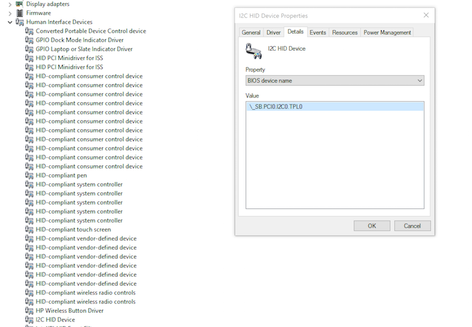
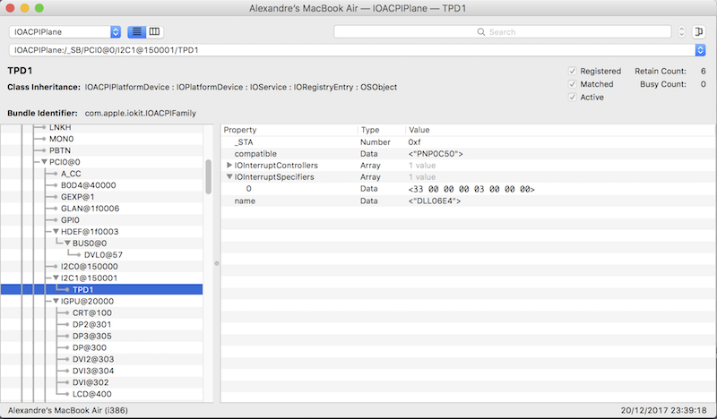

#<cldoc:GPIO Pinning>

&#8291;

#### Introduction

The VoodooI2C kexts require decompiling, editing and compiling the DSDT. This guide assumes that you have experience in that. See for instance this [introduction](https://www.tonymacx86.com/threads/guide-patching-laptop-dsdt-ssdts.152573/).

Many patches can be applied using patchfiles downloaded by MaciASL.app from the internet repositories, such as the I2C patches from the VoodooI2C repository. However, no pre-cooked patches are as yet available for patching the _CRS Method of the touch device. Manual editing of the DSDT.dsl file is required. This guide covers that.

If you are able to create a patchfile for use with MaciASL.app, please consider submitting this to the [VoodooI2C Patch Repository](https://github.com/alexandred/VoodooI2C-Patches). See this brief [overview](https://sourceforge.net/p/maciasl/wiki/Patching%20Syntax%20Grammar) of the patch definition format.

Please note that the manual patch must be applied for each I2C device that you wish to use.

This guide requires the following: 

- Pen and a piece of paper to note things down
- Being able to boot into Windows
- Being able to boot into Mac OS X (use a USB-connected mouse)
- IOregistryExplorer.app v2.1 (Do not use any other version!)
- MaciASL.app to decompile and compile the DSDT
- Converting between decimal and hexadecimal numbers

#### Step 1. Determine your ACPI ID and Candidate GPIO PIN numbers

Boot into Windows and open 'Control Panel' -> 'Device Manager'.



In the device tree on the left expand 'Human Interface Devices' and click on 'I2C HID Device'.  The properties window will open. Select the 'Details' tab, and under 'Property' select 'BIOS device name'. Make a note of the Value that is displayed (something similar to '\_SB.PCI0.I2C0.TPL0' or '\_SB.PCI0.I2C1.ETPD'). This is your ACPI ID. Specifically note the last 4 characters. Examples of this are(where x stands for a digit):

1. Touchpads - TPDx, ELAN, SYNA, CYPR, ETPD
2. Touchscreen - TPLx, ELAN, ETPD, SYNA, ATML
3. Sensor Hubs - SHUB

Now reboot into Mac OS X and run IORegistryExplorer.app. Use the search box on the top right and enter those last four characters of your ACPI ID. The window on the left should now show the touch device, and on the right there's an overview of properties and values, as in the image below:



If no device is found, then you probably have to apply a 'Windows' patch (see the Installation guide). You need to fix that before you can continue with this guide.

If the device is present, then check if the property 'IOInterruptSpecifiers' is present. 

- If IOInterruptSpecifiers is not present then you have completed this guide and you can continue with installing the kexts

- If IOInterruptSpecifiers is present, then expand this property and note the first two hexadecimal digits of the value shown. This is your APIC Pin number in hexadecimal notation. Note this down as 0xyy, where yy is replaced by these first two digits.

If your APIC Pin Number is less than or equal to 0x2f, then you have completed this guide and you can proceed with the installation of the kexts.

If your APIC Pin Number is outside the range 0x5c-0x77, then VoodooI2C is not the correct driver for your touchpad. You are advised to seek support in the relevant forums or usergroups.

If your APIC Pin Number is between 0x5c and 0x77, then calculate the corresponding GPIO Pin Number as follows (you can use Calculator.app for hexadecimal conversions and calculations):

- Start with your hexadecimal APIC Pin Number
- Go to this [list](https://github.com/coreboot/coreboot/blob/master/src/soc/intel/skylake/include/soc/gpio_defs.h#L43)
- Search for your APIC Pin Number in the right column. This may appear more than once.
- For each occurence of your APIC Pin Number, note the GP IRQ string on its left. Make a note of each string that corresponds to your APIC Pin Number. In most cases there will be only one corresponding string, but there can be more.

The string or strings you have written down can be in either of two formats:

- the format is "GPDX_IRQ", where X stands for a number. In that case the decimal GPIO Pin Number is X + 144 + 8

- the format "GPP_YX_IRQ". In this format Y stands for a letter that represents the Group and X stands for a decimal number representing the Pad Number. Now calculate the decimal GPIO Pin Number for this format as follows:

    - If the Group equals "A", then the GPIO Pin Number equals the Pad Number
    - If the Group equals "B", then the GPIO Pin Number equals the Pad Number + 24
    - If the Group equals "C", then the GPIO Pin Number equals the Pad Number + 48
    - If the Group equals "D", then the GPIO Pin Number equals the Pad Number + 72
    - If the Group equals "E", then the GPIO Pin Number equals the Pad Number + 96
    - If the Group equals "F", then the GPIO Pin Number equals the Pad Number + 120
    - If the Group equals "G", then the GPIO Pin Number equals the Pad Number + 144

Now convert each of the GPIO Pin Numbers to their hexadecimal values (for instance using Calculator.app). These are your hexadecimal Candidate GPIO Pin numbers. Write these down.

At the end of this step you have your ACPI ID and one or more hexadecimal Candidate GPIO numbers.

#### Step 2. Patching the DSDT

Before you patch your decompiled DSDT.dsl, make a copy of it so you can start over again when needed.

##### Step 2.a The SBFG Name definition

This section requires some familiarity with the structure and the syntax of dsl files. Syntax errors will result in a failure to compile the DSDT.

Extract your DSTD to .dsl format and open it for manual editing. Find the section that contains the definitions for your touchpad by looking for "Device (YYYY)", where 'YYYY' must be replaced by the last four characters of your ACPI ID (for instance resulting in  "Device (ETPD)" or something similar).

Check that this occurence is enclosed in a Scope definition which corresponds to the first parts of your ACPI ID to make sure that you have the right Device. Any changes that you will make using this guide are restricted to this Device section.

Within this Device section, find a Name declaration for "SBFG", which should look like similar to:

```
    Name (SBFG, ResourceTemplate ()
    {
	GpioInt (Level, ActiveLow, ExclusiveAndWake, PullDefault, 0x0000,
	    "\\_SB.PCI0.GPI0", 0x00, ResourceConsumer, ,
	    )
	    {   // Pin list
		0x0000
	    }
    })
```

If this does not exist directly under the Device definition, then check if it appears inside the definition of the _CRS method for the Device.

If there is no Name definition for SBFG (within the Device definition or its _CRS Method definition), then add the definition that is given above to the Device definition, just before the _CRS Method definition.

At this stage you have located or created the SBFG Name definition. This contains a Pin List value, on the line below the comment "// Pin list".

If the Pin list in the SBFG ResourceTemplate definition has a value other than zero (0x0000 or 0x00), then do not make any changes here (the value is probably your Candidate GPIO Pin Number, but that is not guaranteed) and proceed to step 2.b.

If the Pin list in the SBFG ResourceTemplate has a value of zero (0x0000 or 0x00) then replace that value with your hexadecimal Candidate GPIO Pin Number. If you have more than one Candidate GPIO Pin number, then select one of them and continue this guide and the kext installation. If that does not result in a working touch device, then change this value to another candiate GPIO Pin Number and try again.

At the end of this step you have located or created the SBFG Name definition and the Pin list in that definition has a value that is not zero.

##### Step 2.b The SBFB Name definition

Check if there is an SBFB Name definition within the Device section that you are working on. This may be directly under the Device section or inside of the _CRS method.

If there is no such Name definition, check if there is a Name definition for SBFI (directly under the Device or in its _CRS Method). Look for: "Name (SBFI, ResourceTemplate ()"

If the SBFI Name is present, then change the identifier SBFI to SBFB and remove the Interrupt section if that appears within the SBFI. The result should look similar to the example below (note that the arguments in your I2cSerialBusV2 call may have different values. That is ok, do not change those values):

```
	Name (SBFB, ResourceTemplate ()
	{
		I2cSerialBusV2 (0x00yy, ControllerInitiated, 0x000yyyy,
				AddressingMode7Bit, "\\_SB.PCI0.I2C1",
				0x00, ResourceConsumer, , Exclusive,
				)
	})
```

At the end of this step you have ensured that there is an SBFB definition in the Device section or in the _CRS Method definition.

##### Step 2.c The _CRS Method definition

Now go to the _CRS Method in the Device section that you're working in, and remove all Return statements, including any surrounding If statements for those Return statements. Then, at the end of _CRS Method section, add the following Return statement:

```
    Return (ConcatenateResTemplate (SBFB, SBFG))
```

Your _CRS Method definitions then should be similar to:

```
	Method (_CRS, 0, Serialized)    // _CRS: Current Resource Settings
	{
		// The _CRS method can also contain Name definitions (in any order):
		// A Name (SBFB, ResourceTemplate()) definition, unless that already 
		// appears directly under the Device
		// A Name (SBFG, ResourceTemplate()) definition, unless that already
		// appears directly under the Device

		Return (ConcatenateResTemplate (SBFB, SBFG))
	}
```

At the end of this step you have ensured that the _CRS Method returns the concatenation of the ResourceTemplates SBFB and SBFG.

#### Step 3. Install the DSDT and reboot

Save the DSDT.dsl and compile it to DSDT.aml using MaciASL.app. Mount the EFI partition and place DSDT.aml in EFI/CLOVER/ACPI/patched. 

Now reboot into Mac OS X and run IORegistryExplorer.app. Use the search box on the top right and enter the last four characters of your ACPI ID. The window on the left should now show the device, and on the right there's an overview of properties and values. Check that the property IOInterruptSpecifiers is no longer present. If it is present, go back over this guide and check your changes, or if have two or more Candidate GPIO Pin Numbers, then try again with a different Pin Number.

If the property IOInterruptSpecifiers does not appear, then you have completed this guide and you can continue with the installation of the kexts.
